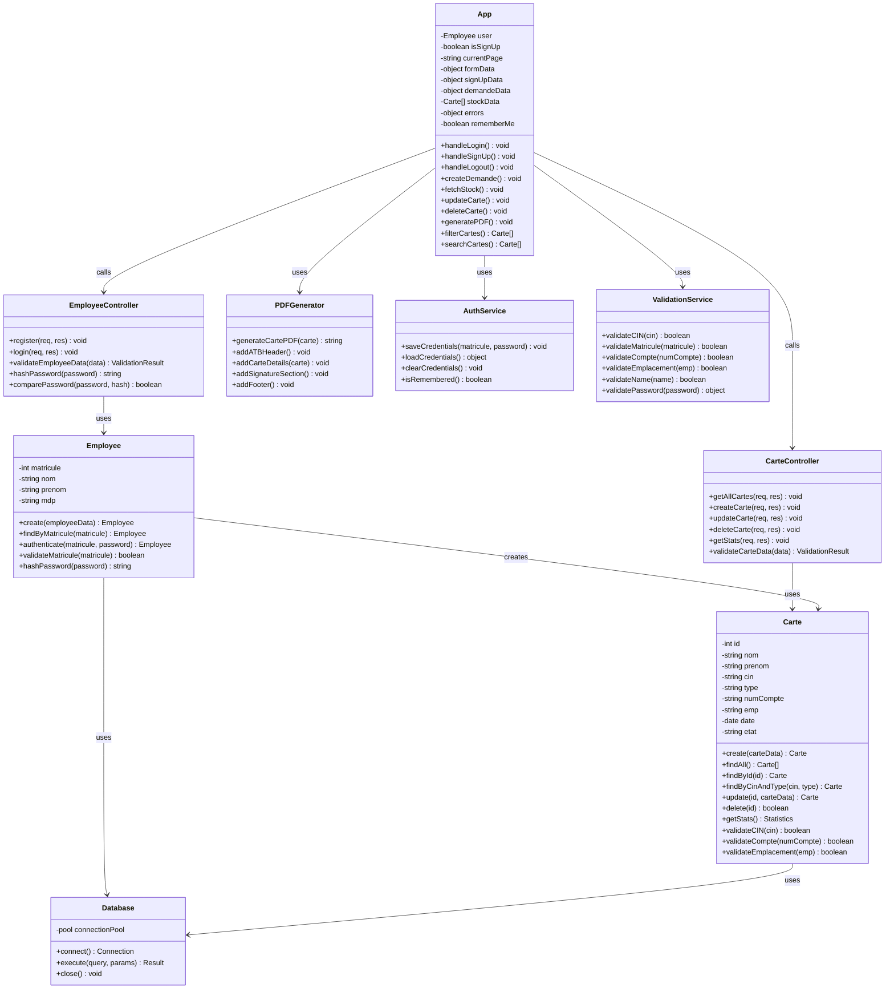
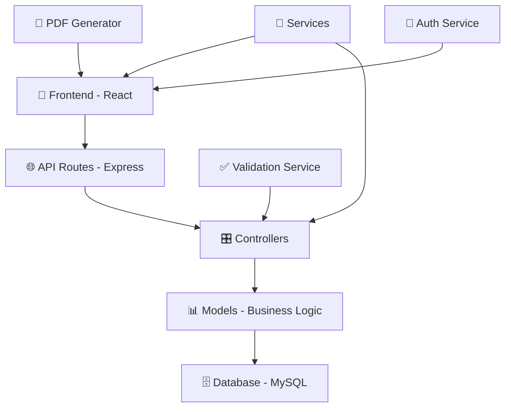

# 📊 Diagramme de Classes - Système ATB

## 🏗️ Architecture Globale



## 📋 Détails des Classes

### 🏢 **Employee (Modèle)**
```javascript
class Employee {
    // Attributs
    - matricule: int (6 chiffres, unique)
    - nom: string (2-50 caractères)
    - prenom: string (2-50 caractères)
    - mdp: string (haché avec bcrypt)
    
    // Méthodes statiques
    + create(employeeData): Promise<Employee>
    + findByMatricule(matricule): Promise<Employee>
    + authenticate(matricule, password): Promise<Employee>
    
    // Validations
    + validateMatricule(matricule): boolean
    + hashPassword(password): Promise<string>
}
```

### 💳 **Carte (Modèle)**
```javascript
class Carte {
    // Attributs
    - id: int (auto-increment)
    - nom: string (client)
    - prenom: string (client)
    - cin: string (8 chiffres exactement)
    - type: string (12 types disponibles)
    - numCompte: string (10-20 chiffres)
    - emp: string (emplacement: A1, B2, etc.)
    - date: Date
    - etat: enum ('en_stock', 'en_cours', 'delivree')
    
    // Méthodes CRUD
    + create(carteData): Promise<Carte>
    + findAll(): Promise<Carte[]>
    + findById(id): Promise<Carte>
    + update(id, carteData): Promise<Carte>
    + delete(id): Promise<boolean>
    + getStats(): Promise<object>
    
    // Validations
    + validateCIN(cin): boolean
    + validateCompte(numCompte): boolean
    + validateEmplacement(emp): boolean
}
```

### 🎛️ **App (Composant Principal React)**
```javascript
class App {
    // États principaux
    - user: Employee | null
    - currentPage: string
    - stockData: Carte[]
    - rememberMe: boolean
    
    // Gestion de l'authentification
    + handleLogin(): Promise<void>
    + handleSignUp(): Promise<void>
    + handleLogout(): void
    
    // Gestion des cartes
    + createDemande(): Promise<void>
    + fetchStock(): Promise<void>
    + updateCarte(id, data): Promise<void>
    + deleteCarte(id): Promise<void>
    
    // Fonctionnalités avancées
    + generatePDF(carte): void
    + filterCartes(filters): Carte[]
    + searchCartes(term): Carte[]
}
```

### 🎯 **Controllers (API REST)**
```javascript
class CarteController {
    + GET /api/cartes → getAllCartes()
    + POST /api/cartes → createCarte()
    + PUT /api/cartes/:id → updateCarte()
    + DELETE /api/cartes/:id → deleteCarte()
    + GET /api/cartes/stats → getStats()
}

class EmployeeController {
    + POST /api/employees/register → register()
    + POST /api/employees/login → login()
}
```

## 🔗 Relations Principales

1. **Employee** `1` → `*` **Carte** (Un employé peut créer plusieurs cartes)
2. **App** utilise **CarteController** et **EmployeeController**
3. **Controllers** utilisent les **Models** (Carte, Employee)
4. **Models** utilisent **Database** pour la persistance
5. **App** utilise **PDFGenerator** pour les documents
6. **App** utilise **AuthService** pour la persistence des identifiants

## 📊 Types de Données

### **États des Cartes**
```javascript
enum EtatCarte {
    EN_STOCK = 'en_stock',      // Bleue #2196F3
    EN_COURS = 'en_cours',      // Orange #FF9800
    DELIVREE = 'delivree'       // Verte #4CAF50
}
```

### **Types de Cartes (12 types)**
```javascript
const TYPES_CARTES = [
    'visa-electron-debit',
    'c-jeune',
    'visa-classique-nationale',
    'mastercard',
    'virtuelle-epay',
    'technologique-cti',
    'visa-gold',
    'mastercard-world',
    'moussafer-platinum',
    'american-express',
    'lella',
    'el-khir'
];
```

### **Validation Rules**
```javascript
const VALIDATION_RULES = {
    CIN: /^[0-9]{8}$/,                    // Exactement 8 chiffres
    MATRICULE: /^[0-9]{6}$/,              // Exactement 6 chiffres
    NUM_COMPTE: /^[0-9]{10,20}$/,         // 10 à 20 chiffres
    EMPLACEMENT: /^[A-Za-z][0-9]{1,3}$/,  // Lettre + 1-3 chiffres
    NOM: /^[a-zA-ZÀ-ÿ\s'-]{2,50}$/       // Lettres, accents, espaces
};
```

---

## 🏛️ Architecture en Couches



Cette architecture respecte le pattern **MVC** (Model-View-Controller) avec une séparation claire des responsabilités.
