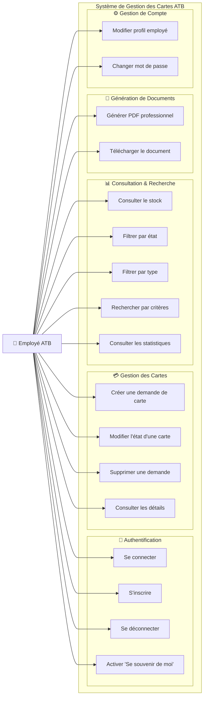
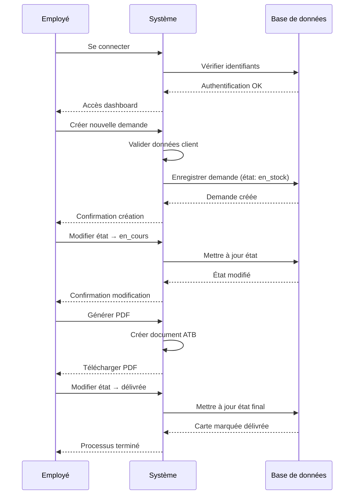
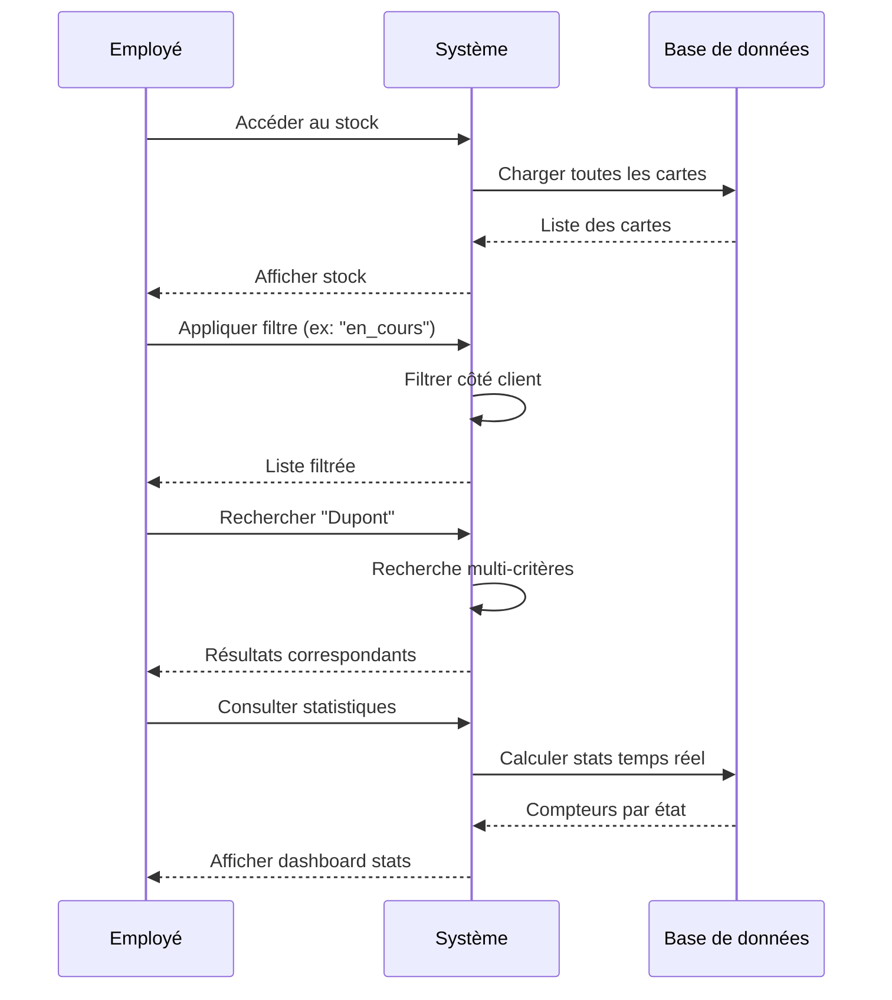

# 👥 Diagramme de Cas d'Utilisation - Système ATB

## 🎯 Vue d'ensemble du Système

```mermaid
graph TD
    A[👤 Employé ATB] --> B[🔐 S'authentifier]
    A --> C[📋 Gérer les Demandes]
    A --> D[📊 Consulter le Stock]
    A --> E[📄 Générer des Documents]
    A --> F[⚙️ Gérer son Compte]
    
    B --> B1[Se connecter]
    B --> B2[S'inscrire]
    B --> B3[Se déconnecter]
    B --> B4[Se souvenir de moi]
    
    C --> C1[Créer une demande]
    C --> C2[Modifier une demande]
    C --> C3[Supprimer une demande]
    C --> C4[Valider les données client]
    
    D --> D1[Lister toutes les cartes]
    D --> D2[Filtrer par état]
    D --> D3[Filtrer par type]
    D --> D4[Rechercher par critères]
    D --> D5[Consulter les statistiques]
    
    E --> E1[Générer PDF client]
    E --> E2[Télécharger le document]
    
    F --> F1[Modifier ses informations]
    F --> F2[Changer mot de passe]
```

## 📊 Diagramme UML des Cas d'Utilisation

## 📋 Détail des Cas d'Utilisation

### 🔐 **CU-01 : Se connecter**
- **Acteur** : Employé ATB
- **Préconditions** : L'employé doit être inscrit dans le système
- **Scénario principal** :
  1. L'employé saisit son matricule (6 chiffres)
  2. L'employé saisit son mot de passe
  3. L'employé peut cocher "Se souvenir de moi"
  4. Le système valide les identifiants
  5. L'employé accède au dashboard
- **Scénarios alternatifs** :
  - Identifiants incorrects → Message d'erreur
  - Format matricule invalide → Validation échoue
- **Post-conditions** : L'employé est authentifié et accède au système

### 📝 **CU-02 : S'inscrire**
- **Acteur** : Nouvel employé ATB
- **Préconditions** : Aucune
- **Scénario principal** :
  1. L'employé remplit le formulaire d'inscription
  2. Le système valide le format du matricule (6 chiffres uniques)
  3. Le système valide la force du mot de passe
  4. Le système vérifie l'unicité du matricule
  5. Le compte est créé avec succès
- **Règles métier** :
  - Matricule : exactement 6 chiffres
  - Mot de passe : minimum 8 caractères
  - Nom/Prénom : lettres, accents, espaces autorisés

### 💳 **CU-03 : Créer une demande de carte**
- **Acteur** : Employé ATB connecté
- **Préconditions** : L'employé doit être authentifié
- **Scénario principal** :
  1. L'employé accède au formulaire "Nouvelle demande"
  2. L'employé saisit les informations client (nom, prénom, CIN)
  3. L'employé saisit le numéro de compte (10-20 chiffres)
  4. L'employé sélectionne le type de carte (12 options)
  5. L'employé définit l'emplacement physique (ex: A1, B2)
  6. Le système valide toutes les données
  7. La demande est créée avec l'état "en_stock"
- **Validations** :
  - CIN : exactement 8 chiffres
  - N° compte : 10 à 20 chiffres
  - Emplacement : format lettre + chiffres
  - Unicité : pas de doublon CIN + type de carte

### 🔄 **CU-04 : Modifier l'état d'une carte**
- **Acteur** : Employé ATB connecté
- **Préconditions** : Une demande de carte existe
- **Scénario principal** :
  1. L'employé consulte la liste des cartes
  2. L'employé sélectionne une carte à modifier
  3. L'employé change l'état (en_stock → en_cours → delivree)
  4. L'employé peut modifier d'autres informations
  5. Le système enregistre les modifications
- **États possibles** :
  - 🔵 **En stock** : Carte disponible
  - 🟠 **En cours** : Carte en préparation
  - 🟢 **Délivrée** : Carte remise au client

### 🔍 **CU-05 : Rechercher et filtrer**
- **Acteur** : Employé ATB connecté
- **Préconditions** : Des cartes existent dans le système
- **Scénario principal** :
  1. L'employé accède à la page "Stock des cartes"
  2. L'employé peut filtrer par :
     - État (tous, en stock, en cours, délivrée)
     - Type de carte (12 types disponibles)
     - Période (7j, 30j, 90j, 1 an)
  3. L'employé peut rechercher par :
     - Nom du client
     - CIN
     - Numéro de compte
  4. La liste se met à jour en temps réel
- **Fonctionnalités avancées** :
  - Recherche multi-critères
  - Tri par colonnes
  - Pagination automatique

### 📄 **CU-06 : Générer un PDF**
- **Acteur** : Employé ATB connecté
- **Préconditions** : Une carte doit être sélectionnée
- **Scénario principal** :
  1. L'employé sélectionne une carte dans le stock
  2. L'employé clique sur "Générer PDF"
  3. Le système crée un document professionnel avec :
     - En-tête ATB officiel
     - Informations client complètes
     - Détails de la carte
     - Emplacement physique
     - Section signature
  4. Le PDF est téléchargé automatiquement
- **Format du document** :
  - Nom : `ATB_Carte_Type_Nom_Prénom_Date.pdf`
  - Charte graphique ATB (bordeaux #A51C30)
  - Format A4 professionnel

### 📊 **CU-07 : Consulter les statistiques**
- **Acteur** : Employé ATB connecté
- **Préconditions** : Des données existent dans le système
- **Scénario principal** :
  1. L'employé accède au dashboard
  2. Le système affiche en temps réel :
     - Nombre total de cartes
     - Nombre de cartes en stock
     - Nombre de cartes en cours
     - Nombre de cartes délivrées
  3. Les statistiques se mettent à jour automatiquement
- **Visualisation** :
  - Compteurs colorés selon l'état
  - Mise à jour en temps réel
  - Calculs automatiques

### 🔐 **CU-08 : Se souvenir de moi**
- **Acteur** : Employé ATB
- **Préconditions** : L'employé se connecte
- **Scénario principal** :
  1. L'employé coche "Se souvenir de moi" lors de la connexion
  2. Le système sauvegarde les identifiants dans localStorage
  3. Lors de la prochaine visite :
     - Les champs sont pré-remplis
     - La case reste cochée
  4. Si décochée lors de la déconnexion :
     - Les champs sont vidés
     - Les données localStorage sont supprimées
- **Sécurité** :
  - Stockage local uniquement
  - Pas de transmission réseau
  - Suppression automatique si décochée

## 🔄 Workflows Principaux

### **Workflow 1 : Gestion complète d'une demande**

### **Workflow 2 : Consultation et recherche**

## 🎯 Acteurs du Système

### **👤 Employé ATB** (Acteur principal)
- **Rôle** : Utilisateur du système de gestion des cartes
- **Responsabilités** :
  - Créer et gérer les demandes de cartes clients
  - Suivre l'évolution des états des cartes
  - Générer la documentation officielle
  - Maintenir les données à jour
- **Compétences requises** :
  - Connaissance des produits bancaires ATB
  - Utilisation d'interfaces web
  - Compréhension des processus bancaires

### **🤖 Système** (Acteur secondaire)
- **Rôle** : Gestionnaire automatique des règles métier
- **Responsabilités** :
  - Validation des données saisies
  - Calcul des statistiques en temps réel
  - Génération automatique des documents
  - Gestion de la persistance des données
- **Fonctionnalités automatiques** :
  - Validation des formats (CIN, matricule, etc.)
  - Prévention des doublons
  - Sauvegarde automatique
  - Calculs statistiques

## 📊 Matrice de Traçabilité

| Cas d'Utilisation | Acteur | Priorité | Complexité | Statut |
|-------------------|--------|----------|------------|---------|
| Se connecter | Employé ATB | 🔴 Haute | 🟡 Moyenne | ✅ Implémenté |
| S'inscrire | Employé ATB | 🔴 Haute | 🟡 Moyenne | ✅ Implémenté |
| Créer demande | Employé ATB | 🔴 Haute | 🔴 Haute | ✅ Implémenté |
| Modifier état | Employé ATB | 🔴 Haute | 🟡 Moyenne | ✅ Implémenté |
| Supprimer demande | Employé ATB | 🟡 Moyenne | 🟢 Faible | ✅ Implémenté |
| Rechercher/Filtrer | Employé ATB | 🔴 Haute | 🟡 Moyenne | ✅ Implémenté |
| Générer PDF | Employé ATB | 🔴 Haute | 🔴 Haute | ✅ Implémenté |
| Consulter stats | Employé ATB | 🟡 Moyenne | 🟢 Faible | ✅ Implémenté |
| Se souvenir de moi | Employé ATB | 🟢 Faible | 🟡 Moyenne | ✅ Implémenté |

## 🎬 Démonstration Pratique

> 📹 **Voir la vidéo `atb_app.mp4`** : Tous ces cas d'utilisation sont démontrés en action dans la vidéo de démonstration complète du système !

La vidéo montre :
- ✅ Processus d'authentification complet
- ✅ Création de demandes avec validation
- ✅ Gestion des états et modifications
- ✅ Utilisation des filtres et recherche
- ✅ Génération de PDF professionnels
- ✅ Navigation responsive mobile/desktop
- ✅ Fonctionnalité "Se souvenir de moi"

---

## 🏛️ Architecture des Cas d'Utilisation

Cette analyse des cas d'utilisation montre un système complet couvrant tous les besoins métier d'un service bancaire pour la gestion des cartes, avec une interface moderne et des processus optimisés pour l'efficacité opérationnelle.
